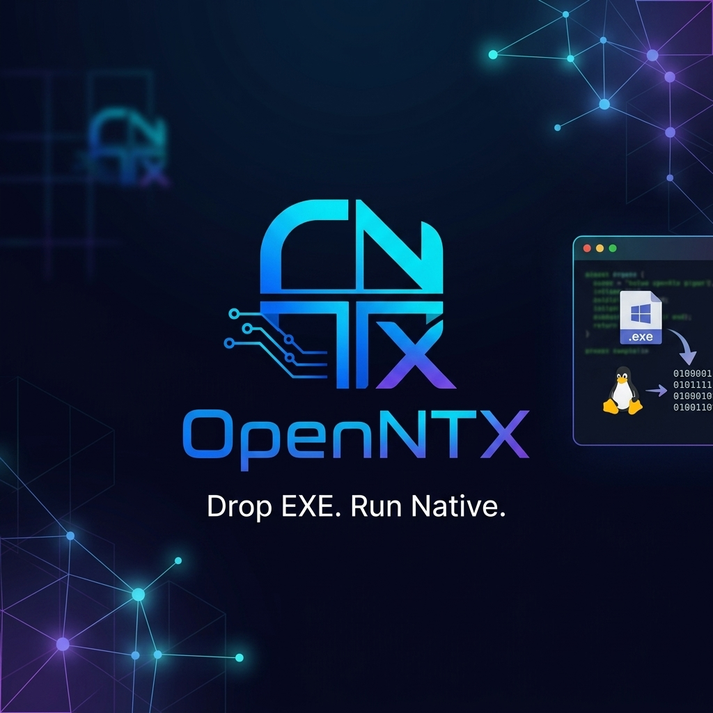
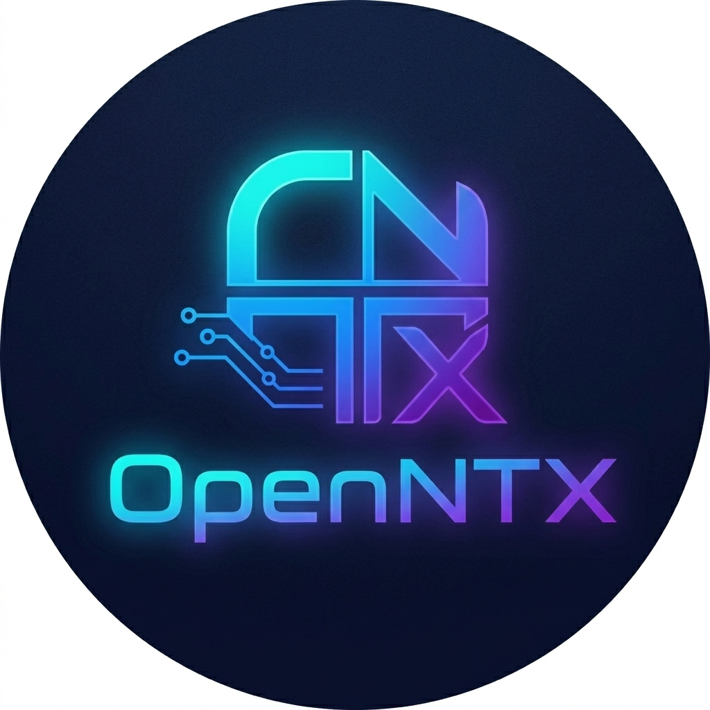

<p align="center">
  
</p>

<p align="center">
  
</p>

# OpenNTX

**Windows Application Subsystem for Linux**

<p align="center">
  <a href="https://github.com/openntx/openntx/actions/workflows/ci.yml"></a>
  
  
  
  
</p>

> **Version: v2.7.0-alpha — The Execution, Hardening, Graphics, Registry, API & GUI Era**
>
> OpenNTX has crossed the Rubicon. The V1.x identity layer is complete.
> The kernel now recognises `.exe` files natively, the runtime executes them
> in isolated sandboxes with cgroups v2 resource governance and namespace
> isolation, the reaper engine culls zombie processes, the TUI monitors
> every capture event in real time through a live IPC bridge, the
> graphics stub provides virtual window surfaces for Windows GDI/DirectX
> applications, and the isolated registry engine emulates Windows Registry
> hives via per-app TOML files. The RESTful API Bridge (`axum`) exposes
> `/api/v1/execute` and `/api/v1/purge` endpoints for GUI integration.
> The Slint-based graphical frontend (`openntx-gui`) provides a Cyberpunk
> Dark Mode interface with real-time system monitoring, app deployment,
> and live log terminal.
> This is no longer a planning tool — **it is a subsystem.**

---

## What OpenNTX Actually Is

OpenNTX is **not** a Wine frontend. It is **not** Proton. It is **not** a
prefix manager.

OpenNTX is a **subsystem** — a structured layer that sits between a Windows
application and the Linux host. It translates application identity, filesystem
layout, registry expectations, and runtime requirements into native Linux
desktop semantics.

When you double-click a `.exe` on an OpenNTX-enabled system:

1. The **Linux kernel** intercepts the execution via `binfmt_misc`.
2. The kernel redirects to `/usr/bin/openntx-runtime`.
3. The runtime **SHA-256 hashes** the PE file and queries the Profile Database.
4. If a profile exists → **isolated execution** with full sandbox policy.
5. If no profile exists → **Intelligent Auto-Fallback**: the runtime silently
   activates a `CaptureSession`, executes the PE, records every filesystem
   change, and **auto-generates a compatibility profile** — all on the first run.
6. Throughout the capture, **live status** is streamed via Unix Domain Socket
   to the TUI AppPortal, which displays a blinking `⚠ [KERNEL] SYSTEM IS
   CAPTURING` banner in real time.

No prefixes. No wrapper scripts. No manual configuration. The subsystem
learns.

---

## Data Flow — Kernel to Glass

```text
  ┌─────────────┐
  │  User runs   │   $ ./app.exe   or   double-click in file manager
  │  a .exe file │
  └──────┬──────┘
         │
         ▼
  ┌──────────────────────────────────────────────────────────────┐
  │  Linux Kernel — binfmt_misc                                   │
  │  Detects MZ header -> traps execution                        │
  │  Redirects to: /usr/bin/openntx-runtime                      │
  └──────┬───────────────────────────────────────────────────────┘
         │
         ▼
  ┌──────────────────────────────────────────────────────────────┐
  │  RuntimeEntrypoint::dispatch_execution()                      │
  │                                                               │
  │  ┌─────────────┐    ┌─────────────────┐    ┌──────────────┐ │
  │  │ SHA-256 Hash │-->│ ProfileManager   │-->│ Profile      │ │
  │  │ of PE file   │    │ lookup (V1.2)    │    │ exists?      │ │
  │  └─────────────┘    └─────────────────┘    └──────┬───────┘ │
  │                                                    │         │
  │                          ┌─────────────────────────┤         │
  │                          │                         │         │
  │                     YES v                    NO v            │
  │              ┌──────────────┐     ┌───────────────────────┐ │
  │              │ OpenNTXExec  │     │ Auto-Fallback Capture │ │
  │              │ .execute_pe()│     │                       │ │
  │              │ (direct run) │     │ 1. Create sandbox     │ │
  │              └──────────────┘     │ 2. CaptureSession     │ │
  │                                   │ 3. Execute PE (1st)   │ │
  │                                   │ 4. Record events      │ │
  │                                   │ 5. Build CompatProfile│ │
  │                                   │ 6. Save to DB         │ │
  │                                   └───────────┬───────────┘ │
  │                                               │             │
  └───────────────────────────────────────────────┘             │
                                                                │
  ┌─────────────────────────────────────────────────────────────┘
  │
  │   During capture (V2.2 IPC Bridge):
  │
  │   ┌────────────────┐    Unix Domain     ┌──────────────────┐
  │   │ RuntimeIpcClient│---Socket (UDS)---->│ RuntimeIpcServer │
  │   │ sends JSON lines│   /tmp/openntx_    │ receives & fwd   │
  │   │ per event       │   runtime.sock     │ via mpsc channel │
  │   └────────────────┘                    └────────┬─────────┘
  │                                                   │
  │                                                   v
  │                                        ┌──────────────────┐
  │                                        │ TUI AppPortal     │
  │                                        │                   │
  │                                        │ ⚠ [KERNEL]        │
  │                                        │ SYSTEM IS         │
  │                                        │ CAPTURING:        │
  │                                        │ app-abc123 -- 47  │
  │                                        │ files tracked     │
  │                                        └──────────────────┘
  v
  ┌──────────────────────────────────────────────────────────────┐
  │  Linux Host                                                    │
  │  Isolated Wine prefix · Native .desktop launcher · Logs       │
  └──────────────────────────────────────────────────────────────┘
```

---

## Roadmap — The Complete Journey

- [x] **V1.0-alpha — Foundation**
  PE/EXE Analyzer, Manifest Generator, App Registry, Desktop Launcher,
  Run-Plan Diagnostics, Capture Snapshot/Diff, Doctor, Logs, Config,
  Shell Completions.

- [x] **V1.1.0 — AppPortal UX & Async Event Loop**
  Async TUI with crossterm (dedicated OS thread), Library/Details/Capture/
  Package/Doctor/Logs screens, background workers, graceful terminal teardown.

- [x] **V1.2.0 — Compatibility Profile Database**
  Per-app `CompatProfile` schema (metadata, runtime reqs, filesystem rules,
  registry rules, installer behaviour), `ProfileManager` with JSON persistence
  at `~/.local/share/openntx/profiles/`.

- [x] **V1.3.0 — Advanced Installer Capture Workflow**
  Real-time filesystem capture via Linux `inotify`. Streaming event model
  replaces old snapshot-before/after. Recursive auto-watch, symlink rejection,
  non-blocking polling with 250ms idle sleep.

- [x] **V1.4.0 — Debian Package Builder & Linux Integration**
  Profile-driven `.deb` builder with `DEBIAN/control` generation, native
  `.desktop` launcher, cross-filesystem safety, `dpkg-deb` toolchain.

- [x] **V2.0.0 — Kernel Integration via binfmt_misc & Isolated PE Executor**
  `BinfmtManager` registers PE format (`MZ` magic) with Linux kernel.
  `OpenNTXExecutor` orchestrates SHA-256 identification -> profile lookup ->
  sandbox setup -> Wine headless execution with `WINEDEBUG=-all` isolation.

- [x] **V2.1.0 — Runtime Entrypoint with SHA256 Profiling & Auto-Fallback**
  `RuntimeEntrypoint` parses kernel-supplied arguments, dispatches execution.
  **Intelligent Auto-Fallback**: on first run of an unknown PE, automatically
  activates `CaptureSession`, executes the PE, analyses captured events,
  and persists a new `CompatProfile` — zero user intervention.

- [x] **V2.2.0 — Live Monitoring & TUI Integration via UDS IPC**
  Unix Domain Socket IPC bridge between runtime process and TUI process.
  `RuntimeIpcServer` listens on `/tmp/openntx_runtime.sock`.
  `RuntimeIpcClient` sends JSON-line status updates during capture.
  TUI displays real-time blinking banner: `⚠ [KERNEL] SYSTEM IS CAPTURING`.

- [x] **V2.3.0 — cgroups v2 Resource Governance & Namespace Hardening**
  `ResourceGovernor` creates per-app cgroup subtrees for memory and CPU
  limits. `SecurityConfig` tiers (hardened/permissive/default) control
  `CLONE_NEWNET` and `CLONE_NEWNS` namespace isolation via `pre_exec`.

- [x] **V2.4.0 — Process Reaper Engine**
  `ReaperEngine` reads PIDs from `cgroup.procs`, sends SIGTERM, waits
  500ms grace period, then SIGKILLs survivors. `cleanup_cgroup_node`
  removes the cgroup directory after all processes are dead.

- [x] **V2.5.0 — Graphics Stub & Virtual Window Mapping**
  `WindowStubManager` allocates virtual HWNDs for sandboxed Windows
  applications. Headless mode: memory-mapped RGBA framebuffer files.
  X11 mode: display connection intent recorded. `map_gdi_flush` receives
  raw pixel data from the Windows emulation layer.

- [x] **V2.6.0 — Isolated Registry Emulation**
  `VirtualRegistry` emulates Windows Registry hive structure (HKLM, HKCU,
  etc.) using per-app TOML files in the sandbox. `get_value`/`set_value`
  with immediate disk flush. Supports nested key paths, value listing,
  deletion, and TOML persistence across process restarts.

- [x] **V2.6.5 — RESTful API Bridge for GUI Integration**
  `ApiBridgeServer` (axum) exposes `POST /api/v1/execute` and
  `POST /api/v1/purge` endpoints. Bridges GUI AppPortal to the runtime
  kernel. Supports hardened/permissive security modes.

- [x] **V2.7.0 — Slint GUI Frontend & API Client Bridge**
  `openntx-gui` crate with Slint UI (Cyberpunk/Industrial Dark Mode).
  System monitor header (PIDs, RAM, CPU), app grid view, deploy button,
  real-time log terminal. Async API client via `reqwest` with 1s polling
  loop for live monitor data.

---

## Core Subsystems — V2.x Execution Era

### Kernel Subsystem Execution (V2.0 & V2.1)

The `binfmt_misc` mechanism allows the Linux kernel to recognise custom
executable formats. OpenNTX registers the PE format by writing the magic
string `:OpenNTX:M::MZ::/usr/bin/openntx-runtime:OC` to
`/proc/sys/fs/binfmt_misc/register`.

From that moment, **every `.exe` file on the system** is intercepted by the
kernel at the `execve()` level. The kernel sees the `MZ` header, matches the
binfmt rule, and redirects execution to the OpenNTX runtime binary.

**The Entrypoint (`RuntimeEntrypoint`):**

```rust
// parse_kernel_args: argv[0] = interpreter, argv[1] = PE path, argv[2..] = args
let (exe_path, app_args) = RuntimeEntrypoint::parse_kernel_args(env_args)?;

// dispatch_execution: SHA-256 -> profile lookup -> execute or fallback
entrypoint.dispatch_execution(&exe_path, &app_args)?;
```

**Intelligent Auto-Fallback** — When a PE file has no existing profile:

1. An isolated sandbox directory is created under
   `~/.local/share/openntx/sandboxes/<app_id>/`.
2. A `CaptureSession` starts inotify tracking on the entire sandbox tree.
3. The PE is executed for the first time through Wine headless.
4. Every `FileCreated` and `FileModified` event is collected.
5. A `CompatProfile` is constructed from the captured paths (Windows-style
   `C:\...` required paths, deduplicated and normalised).
6. The profile is persisted to `~/.local/share/openntx/profiles/<app_id>.json`.
7. All subsequent runs use the profile for guided isolation.

The user never sees any of this. They double-click an `.exe` and it just works.

**The Executor (`OpenNTXExecutor`):**

- Validates PE magic bytes (`MZ` header check).
- Computes SHA-256 hash for deterministic app identification.
- Queries `ProfileManager` for existing `CompatProfile`.
- Prepares isolated Wine prefix with `drive_c` structure.
- Selects Wine binary based on architecture (x86 -> `wine`, x86_64 -> `wine64`).
- Sets `WINEPREFIX`, `WINEDEBUG=-all`, `WINEESYNC=1` for clean isolation.
- Suppresses all Wine stdout/stderr noise.

### Real-time TUI IPC Bridge (V2.2)

The runtime and the TUI are separate processes. They communicate through a
**Unix Domain Socket** at `/tmp/openntx_runtime.sock` using a JSON-line
protocol.

**Protocol:**

```json
{"app_id":"notepadpp-a3f2","status":"Capturing","files_tracked":47}
```

**Server side (`RuntimeIpcServer`):**

- Binds to `/tmp/openntx_runtime.sock` (removes stale socket on startup).
- Non-blocking accept loop on a dedicated OS thread (100ms poll interval).
- Reads newline-delimited JSON from each connection.
- Forwards `CaptureStatusMessage`s through a `mpsc::Receiver` channel.
- Auto-cleans socket file on `Drop`.

**Client side (`RuntimeIpcClient`):**

- Short-lived connections: connect -> write JSON line -> flush -> close.
- `try_send_status()` for fire-and-forget (silently ignores missing server).
- Integrated into `RuntimeEntrypoint::fallback_capture_and_execute()`:
  sends `Capturing` -> `Executing` -> `Capturing(N files)` -> `Complete`.

**TUI integration:**

- `RuntimeIpcServer` spawned at AppPortal startup.
- Forwarding thread converts IPC messages -> `AppEvent::IpcCaptureStatus`.
- Tokio event loop delivers to `AppState::handle_ipc_capture_status()`.
- Footer renders blinking banner with alternating Red/Yellow colors:

```text
  ⚠ [KERNEL] SYSTEM IS CAPTURING: Capturing: notepadpp-a3f2 — 47 files tracked
```

---

## V1.3.0 — Real-time Capture Engine (Reference)

The capture system uses Linux `inotify` with a dedicated OS thread.

```text
  ┌──────────────────────┐   inotify (non-blocking)   ┌─────────────────┐
  │  OS thread            │ ─────────────────────────► │  mpsc::Receiver  │
  │  inotify fd polling   │   CaptureEvent stream      │  caller thread   │
  └──────────────────────┘                             └─────────────────┘
```

- **Non-blocking polling** — `O_NONBLOCK` via `fcntl(F_SETFL)`. 250ms sleep
  between idle polls. Shutdown via receiver drop detection.
- **Recursive auto-watch** — New directories (`CREATE + ISDIR`) are
  automatically watched. Files created inside new subdirectories are captured.
- **Event filtering** — Only `CREATE`, `MODIFY`, `DELETE`. All other inotify
  events silently ignored.
- **Symlink rejection** — `symlink_metadata()` + `DONT_FOLLOW` flag.

---

## V1.4.0 — Debian Package Builder (Reference)

Profile-driven `.deb` builder:

```text
  CompatProfile -> DebBuilder -> prepare_workspace() -> generate_control_file()
                 -> generate_desktop_entry() -> build_deb() -> .deb output
```

- Architecture mapping: x86 -> `i386`, x86_64 -> `amd64`.
- Cross-filesystem safety: `rename()` -> `copy()+remove()` fallback.
- Staging auto-cleanup on success, preserved on failure.

---

## Tech Stack

**Language:** Rust (edition 2021, MSRV 1.75)

**Cargo Workspace:**

```text
crates/
  openntx-core       Core engine — PE analysis, manifests, profiles,
                     real-time capture (inotify), package building (.deb),
                     runtime subsystem (binfmt, executor, entrypoint, IPC),
                     desktop integration, doctor, logs, config, sandbox.

  openntx-cli        CLI for automation and diagnostics. JSON output.
                     Shell completions (bash, zsh, fish).

  openntx-appportal  Async TUI (ratatui + crossterm). Dedicated OS thread
                     for input. Tokio background workers. Live IPC bridge
                     for real-time capture status display.

  openntx-gui        Slint-based graphical frontend (Cyberpunk Dark Mode).
                     System monitor, app grid, deploy, real-time log.
                     Async API client via reqwest + tokio polling.
```

**Runtime module structure (`openntx-core/src/runtime/`):**

```text
  runtime/
    mod.rs           Module root and re-exports
    binfmt.rs        BinfmtManager — kernel binfmt_misc registration
    executor.rs      OpenNTXExecutor — PE validation, sandbox, Wine launch
    entrypoint.rs    RuntimeEntrypoint — kernel args, dispatch, auto-fallback
    ipc.rs           RuntimeIpcServer/Client — UDS live status bridge
    cgroups.rs       ResourceGovernor — cgroups v2 memory/CPU limits
    reaper.rs        ReaperEngine — SIGTERM/SIGKILL process reaping
    graphics.rs      WindowStubManager — virtual HWND & framebuffer
    registry.rs      VirtualRegistry — isolated Windows Registry emulation
    api.rs           ApiBridgeServer — RESTful API bridge (axum)
    backend.rs       RuntimeBackend trait and execution plans
    placeholder.rs   NotImplemented/External/Future backend stubs
    run_plan.rs      Run-plan generation and logging
```

**Key dependencies:**

| Crate | Purpose |
|---|---|
| `ratatui` | Terminal UI rendering |
| `crossterm` | Terminal I/O (raw mode, alternate screen) |
| `tokio` | Async runtime for TUI event loop and workers |
| `serde` / `serde_json` | JSON serialization (manifests, profiles, IPC) |
| `inotify` | Linux filesystem event monitoring |
| `libc` | POSIX calls (`fcntl`, `geteuid`, `O_NONBLOCK`) |
| `thiserror` | Structured error types with `thiserror::Error` |
| `sha2` | SHA-256 hashing for PE identification |
| `tar` / `flate2` | Export/import bundle compression |
| `dirs` | XDG data directory resolution |
| `tempfile` | Secure temporary directories (tests) |

**Data formats:**

| Schema | Location |
|---|---|
| App Manifest | `schemas/app-manifest.schema.json` |
| Compatibility Profile | `schemas/compatibility-profile.schema.json` |
| Capture Report | `schemas/capture-report.schema.json` |
| Capture Snapshot | `schemas/capture-snapshot.schema.json` |
| Capture Diff | `schemas/capture-diff.schema.json` |

---

## Test Coverage

**327 tests, 0 failures.** Full breakdown:

| Module | Tests | Coverage |
|---|---|---|
| `runtime::binfmt` | 12 | Registration string, MZ magic, root check, field count, custom path |
| `runtime::executor` | 12 | PE detection, SHA-256, sandbox creation, Wine env, args passthrough |
| `runtime::entrypoint` | 17 | Kernel args parsing, dispatch flow, fallback capture, profile build |
| `runtime::ipc` | 9 | Message round-trip, server-client E2E, cleanup, error handling |
| `runtime::cgroups` | 17 | Path generation, sanitization, cpu_max_from_percent, apply_limits, cleanup |
| `runtime::reaper` | 19 | PID parsing, SIGTERM/SIGKILL flow, cgroup cleanup, signal helpers |
| `runtime::graphics` | 22 | Surface creation, HWND allocation, GDI flush, framebuffer I/O, destruction |
| `runtime::registry` | 24 | Write-then-read, persistence, TOML validation, hive CRUD, key normalization |
| `runtime::api` | 6 | Execute endpoint, purge endpoint, validation, error handling, 404 |
| `openntx-gui` | 9 | App ID derivation, log state, monitor response, execute response, timestamp |
| `profile` | 12 | CRUD, round-trip, arch serde, optional fields |
| `capture::realtime` | 7 | inotify events, nested dirs, ordering, shutdown |
| `capture::snapshot/diff` | 14 | Snapshots, diffs, symlinks, registry tracking |
| `packaging::deb` | 10 | Control file, desktop entry, staging, dpkg-deb |
| `builder::debian` | 10 | Workspace, control, desktop, options |
| `pe_analyzer` | 6 | PE32/PE64 detection, imports, architecture |
| `manifest` | 10 | Generation, validation, JSON schema |
| `registry` | 9 | Registration, desktop, run-plan, remove |
| `v1_alpha` | 33 | Config, doctor, rename, duplicate, export/import, logs |
| `doctor` | 4 | Global/app diagnostics, repair |
| Integration tests | 59 | End-to-end workflows |
| Doc-tests | 7 | Compile-check all public doc examples |

---

## Quick Start

```bash
# Build the workspace
cargo build --release

# Analyse a Windows EXE
./target/release/openntx analyze /path/to/app.exe

# Register an app
./target/release/openntx register /path/to/app.exe

# Launch the TUI (IPC server starts automatically)
./target/release/openntx-appportal

# Build a .deb package
./target/release/openntx package build <app-id> --yes

# Register binfmt_misc (requires root)
sudo ./target/release/openntx runtime register

# Run doctor diagnostics
./target/release/openntx doctor --global
```

---

## Documentation

| Document | Description |
|---|---|
| [docs/vision.md](docs/vision.md) | Long-term vision and design philosophy |
| [docs/architecture.md](docs/architecture.md) | System architecture and module boundaries |
| [docs/manifest-spec.md](docs/manifest-spec.md) | App manifest specification |
| [docs/sandbox-model.md](docs/sandbox-model.md) | Sandbox and isolation model |
| [docs/runtime-design.md](docs/runtime-design.md) | Runtime backend design |
| [docs/installer-capture.md](docs/installer-capture.md) | Installer capture workflow |
| [docs/packaging.md](docs/packaging.md) | .deb package builder |
| [docs/desktop-integration.md](docs/desktop-integration.md) | Desktop launcher generation |
| [docs/testing.md](docs/testing.md) | Test strategy and coverage |
| [ROADMAP.md](ROADMAP.md) | Detailed roadmap with milestones |
| [CONTRIBUTING.md](CONTRIBUTING.md) | Contribution guidelines |

---

## The Golden Rule

> **OpenNTX will never become a Wine manager.**

Wine is a compatibility layer. Proton is a Wine distribution. Lutris, Bottles,
and PlayOnLinux are prefix managers.

OpenNTX is a **subsystem**.

It builds its own application identity layer — manifests, profiles, sandbox
policies, filesystem mappings, registry overlays, kernel-level PE interception,
and intelligent auto-capture — so that a Windows application can be managed,
isolated, and integrated into the Linux desktop as a structured, auditable
entity.

The runtime uses Wine as an execution backend today. Tomorrow it may use
something else. The compatibility profile database, the sandbox model, and the
manifest-driven architecture exist specifically so that OpenNTX can evolve its
own runtime without depending on any single external compatibility layer.

---

## License

OpenNTX is licensed under the
[PolyForm Noncommercial License 1.0.0](LICENSE).
See [COMMERCIAL-LICENSE.md](COMMERCIAL-LICENSE.md) for commercial use.
