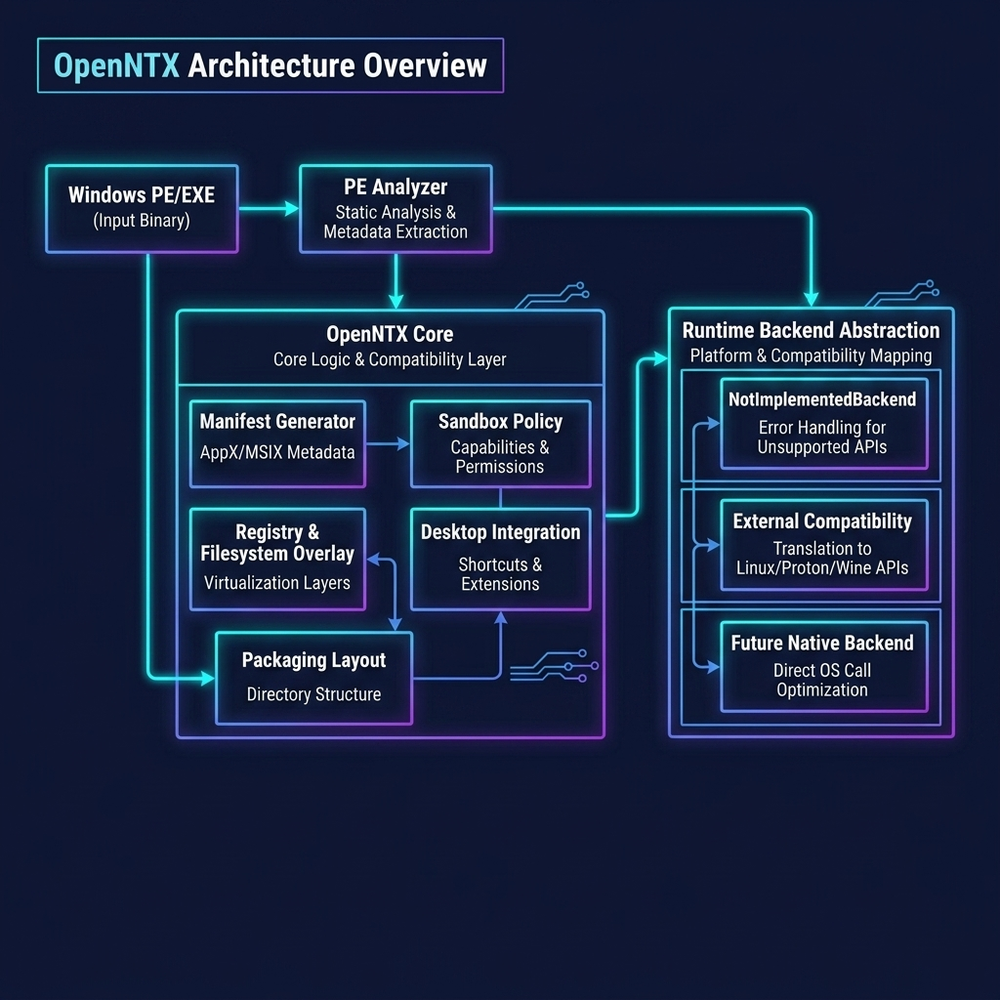
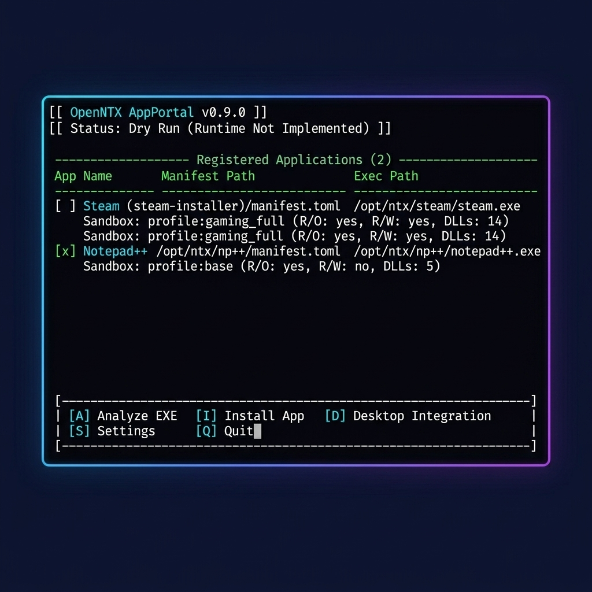

# OpenNTX

<p align="center">
  
</p>

<p align="center">
  
</p>

<p align="center">
  <a href="https://github.com/openntx/openntx/actions/workflows/ci.yml"></a>
  
  
  
</p>

**Drop EXE. Run Native.**

OpenNTX is an experimental Windows application subsystem for Linux. It aims to make Windows PE/EXE applications feel like native Linux desktop apps by combining PE detection, app manifests, installer capture, sandboxing, desktop integration, and a future NT/Win32 compatibility runtime.

OpenNTX is a source-available project. The default license is noncommercial; commercial use requires explicit written permission from Đặng Nhất Phi. See [LICENSE](LICENSE), [COMMERCIAL-LICENSE.md](COMMERCIAL-LICENSE.md), and [CONTRIBUTOR-LICENSE-TERMS.md](CONTRIBUTOR-LICENSE-TERMS.md).

## What OpenNTX Is

- A systems-level foundation for Windows app integration on Linux.
- A manifest-driven model for per-app state, registry overlays, sandbox policy, desktop launchers, and packaging metadata.
- A future home for PE loader, NT runtime, Win32 API, graphics, audio, input, and service-broker research.
- A source-available public codebase for contributors interested in Linux desktop compatibility systems.

## What OpenNTX Is Not

- Not a Wine wrapper.
- Not a Bottles clone.
- Not a Lutris clone.
- Not a VM manager.
- Not a complete Windows runtime in V0.9.
- Not a tool for bypassing DRM, anti-cheat, security controls, or malware analysis safeguards.

## Why This Exists

Linux users should not need to understand prefixes, wrapper scripts, VM setup, random launchers, or compatibility-layer internals just to install a desktop application. The long-term OpenNTX goal is a workflow where Windows applications can be installed, isolated, represented in menus, removed, diagnosed, and packaged with Linux-native conventions.

The target user experience:

1. Drag an `.exe` installer into OpenNTX AppPortal.
2. OpenNTX analyzes the PE file.
3. OpenNTX creates an install/capture plan.
4. OpenNTX captures installer output into per-app state.
5. OpenNTX generates an app manifest.
6. OpenNTX creates a Linux desktop launcher.
7. The app appears in the Linux application menu.

## Current Status

OpenNTX V0.9 is an experimental foundation with real PE analysis, manifest generation, local app registry plan writing, Linux desktop launcher writing, run-plan diagnostics, installer capture snapshot/diff infrastructure, .deb package builder, and a registry-backed AppPortal TUI.

V0.9 adds .deb package builder with root-owned package contents and proper file permissions. It does not run Windows installers yet.

It includes:

- repository structure
- architecture documentation
- JSON schemas
- example manifests and capture reports
- Rust core models
- real PE metadata analyzer for headers, sections, entry point, image base, subsystem, and imported DLL names
- manifest generator that converts PE metadata into OpenNTX app manifests
- local app registry writer for analysis-only install plans
- desktop launcher writer for registered apps
- run-plan UX that loads registered manifests, prints real app metadata, writes diagnostics logs, and can notify desktop users
- CLI skeleton
- registry-backed AppPortal TUI for registered apps and basic OpenNTX actions
- development scripts
- basic tests
- installer capture snapshot/diff infrastructure for OpenNTX app directories (analysis-only, no installer execution)

It does not run arbitrary Windows software. Runtime execution, installer capture, Win32 compatibility, DirectX translation, driver support, and full sandbox enforcement are future research areas.

## Architecture Overview

<p align="center">
  
</p>

```text
Windows PE/EXE
    |
    v
PE analyzer
    |
    v
OpenNTX Core
    |
    +--> manifest generator/resolver
    +--> sandbox policy
    +--> registry/filesystem overlay model
    +--> desktop integration
    +--> packaging layout
    |
    v
Runtime backend abstraction
    |
    +--> NotImplementedBackend        (V0.9)
    +--> ExternalCompatibilityBackend (future placeholder)
    +--> FutureNativeBackend          (future PE/NT/Win32 research)
```

The CLI and AppPortal call the core. Runtime logic must not live in the GUI.

## AppPortal Concept

AppPortal is the user-facing install surface. V0.9 ships as a lightweight terminal UI that reads the real OpenNTX app registry and manages analysis-only registry actions without heavy GUI dependencies.

<p align="center">
  
</p>

Current AppPortal surfaces:

- Home with OpenNTX version, registered app count, runtime status, and action menu.
- App library backed by `~/.local/share/openntx/apps/`.
- App details with manifest path, executable path, sandbox profile, imported DLL count, desktop launcher status, and capture actions.
- Analyze EXE flow that reads PE metadata and can preview generated manifests.
- Install plan flow that writes registry metadata only after confirmation.
- Desktop launcher create/remove actions with confirmation.
- Capture actions: Snapshot Before, Snapshot After, Diff, Report, and Status per registered app.
- Settings for default sandbox, runtime backend, compatibility database, diagnostics, and path layout.

## CLI Concept

The `openntx` CLI is the stable automation surface for the core:

```bash
openntx analyze ~/Downloads/setup.exe
openntx manifest generate ~/Downloads/setup.exe
openntx manifest generate ~/Downloads/setup.exe --json
openntx manifest generate ~/Downloads/setup.exe --output /tmp/app.openntx.json
openntx install ~/Downloads/setup.exe
openntx install ~/Downloads/setup.exe --write-plan
openntx install ~/Downloads/setup.exe --write-plan --desktop
openntx desktop create example-app --dry-run
openntx desktop create example-app --yes
openntx desktop remove example-app --dry-run
openntx desktop remove example-app --yes
openntx list
openntx show example-app
openntx remove example-app --dry-run
openntx remove example-app --yes
openntx run example-app
openntx run example-app --json
openntx run example-app --notify
openntx capture snapshot-before example-app
openntx capture snapshot-after example-app
openntx capture diff example-app
openntx capture report example-app
openntx capture status example-app
openntx capture snapshot-before example-app --json
openntx capture diff example-app --json
openntx package build example-app
openntx package build example-app --yes
openntx package build example-app --output dist --version 1.0.0
openntx remove example-app
openntx doctor ~/Downloads/setup.exe
```

V0.9 commands produce validation, manifest generation, local registry plan writing, desktop launcher writing, AppPortal registry UI, run-plan logs, installer capture snapshot/diff, .deb packaging, and planning output. They do not execute Windows binaries.

## Development

Install Rust:

```bash
curl --proto '=https' --tlsv1.2 -sSf https://sh.rustup.rs | sh
source "$HOME/.cargo/env"
```

Build and test:

```bash
cargo build --workspace
cargo test --workspace
tools/dev-check.sh
```

Install the CLI binary:

```bash
cargo install --path crates/openntx-cli
```

This installs the `openntx` binary to `~/.cargo/bin/`. If you have an older version installed, this command will replace it with the latest build.

Optional schema validation:

```bash
python3 -m pip install --user jsonschema
tools/dev-check.sh
```

## How to Test V0.9

Run the required local checks:

```bash
cargo fmt --all -- --check
cargo build --workspace
cargo test --workspace
tools/dev-check.sh
```

Run CLI and AppPortal smoke checks:

```bash
cargo run -p openntx-cli -- package example-app
cargo run -p openntx-cli -- manifest generate ./path/to/app.exe --json
XDG_DATA_HOME="$(mktemp -d)" cargo run -p openntx-cli -- install ./path/to/app.exe --write-plan --desktop
cargo run -p openntx-cli -- run <app-id> --json
cargo run -p openntx-cli -- run <app-id> --notify
tools/mock-install-flow.sh
cargo run -p openntx-appportal
```

Capture CLI smoke tests:

```bash
openntx list
openntx capture snapshot-before <app-id>
# manually create a test file inside ~/.local/share/openntx/apps/<app-id>/drive_c/
openntx capture snapshot-after <app-id>
openntx capture diff <app-id>
openntx capture report <app-id>
openntx capture status <app-id>
ls ~/.local/share/openntx/apps/<app-id>/capture/
cat ~/.local/share/openntx/apps/<app-id>/capture/capture-diff.json
cat ~/.local/share/openntx/apps/<app-id>/capture/capture-report.json
```

Manual AppPortal flow:

1. Start `cargo run -p openntx-appportal`.
2. Open Library to view registered apps.
3. Use Analyze EXE to inspect a PE file and preview a manifest.
4. Use Write Install Plan to register app metadata after confirmation.
5. Use Desktop Launcher to create or remove a launcher after confirmation.
6. Use Run Plan to verify the runtime placeholder and diagnostics log path.

The mock install flow creates a temporary minimal PE fixture and demonstrates analysis, manifest metadata, registry plan writing, desktop launcher writing, and install planning only. OpenNTX V0.9 does not execute Windows binaries or installers.

See [docs/testing.md](docs/testing.md) for the full test guide and V0.9 test boundaries.

## Roadmap Summary

- Phase 0: concept and repository foundation.
- Phase 1: real PE analyzer and manifest generator implemented.
- Phase 2: AppPortal registry UI and future drag-and-drop install flow.
- Phase 3: desktop integration and launcher generation.
- Phase 4: installer capture prototype.
- Phase 5: runtime backend abstraction.
- Phase 6: experimental Win32/NT compatibility research.
- Phase 7: compatibility database and profiles.
- Phase 8: sandboxed app-store-style UX.

See [ROADMAP.md](ROADMAP.md) for the full plan.

## Contributing

Read [CONTRIBUTING.md](CONTRIBUTING.md) and [CONTRIBUTOR-LICENSE-TERMS.md](CONTRIBUTOR-LICENSE-TERMS.md) before submitting patches.

Contributions must keep OpenNTX honest: do not claim compatibility that has not been implemented and tested.
